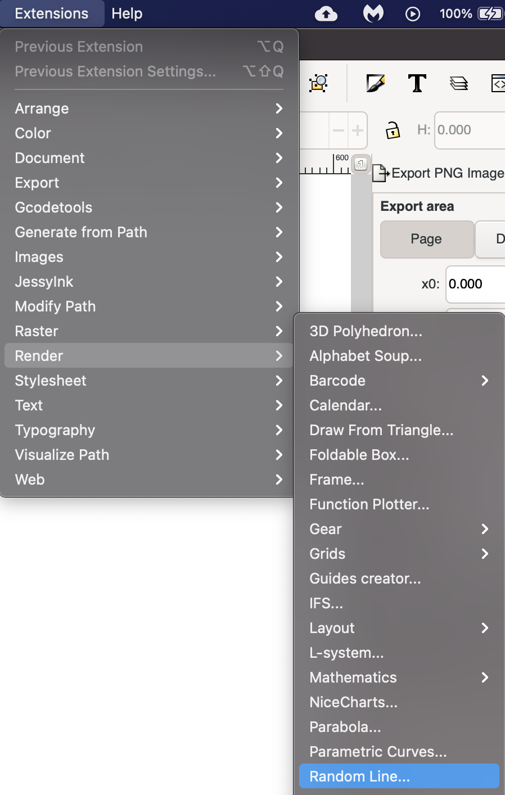
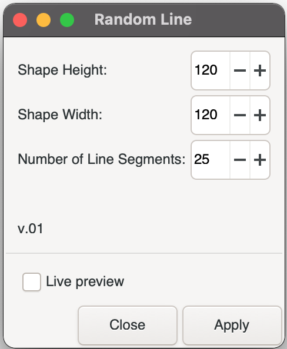
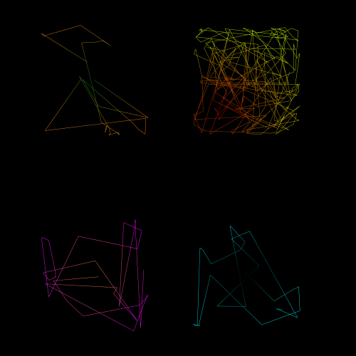
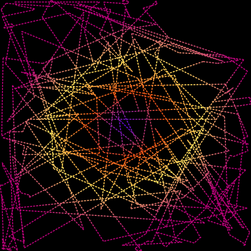

# Random Line v0.1

Random Line is an [Inkscape](https://inkscape.org) extension that renders a lines that changes direction a random number of times.

**NOTE:** *Random Line was developed on a Macintosh and it has been tested on the following platforms:*

* MacOS Big Sur + Inkscape 1.0 - *No issues found*

### Why this extension?
Originally this extension started out as just playing around with extensions.  

After doing my testing, I rather liked many of the sample renders I made.  I also found that if I use other functions in Inkscape you can make some very interesting art.

Suggested things to try:

* Use the fill and stroke menu to add color 
* Use the Stroke Style settings to add texture to the line
* Use filters to distort and change the lines for amazing affects
* JUST HAVE FUN!

## How to install
To install Random Line, place the following files in your Inkscape extensions folder and then restart Inkscape.

On **Linux** or **Windows** you can find your Inkscape extensions folder listed at Edit => Preferences => System: User extensions.

On **MacOS** you can find your Inkscape extensions folder under Inkscape => Preferences => System: User extensions.

* [random_line.inx](https://github.com/opensourcebear/inkscape-extension-random-line/blob/main/random_line.inx)
* [random_line.py](https://github.com/opensourcebear/inkscape-extension-random-line/blob/main/random_line.py)

## Random Line usage
### Starting the Random Line extension

Random Line is accessed from the extensions menu.  Go to Extensions => Render => Random Line

If Random Line doesn't appear in the render list, check that you have installed both files listed above in the correct folder, and that Inkscape has been restarted.

### Configuring your render
Random Line will allow you to set the following options:

1. Shape Height - Overall height of object (100 - 1000)
2. Shape Width - Overall width of the object (100 - 1000)
3. Number of line segments (5 - 1000)

**Hint:** Turn on live preview and observe how the preview result will appear as you change settings to become more familiar with the options.

### Example Renders
These examples were rendered and then color and other textures were added via the fill and stroke menu.

